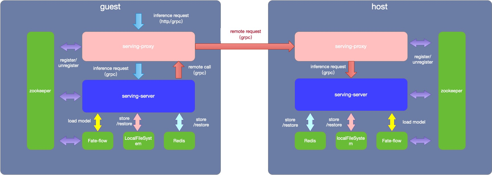

# FATE-Serving

[](https://opensource.org/licenses/Apache-2.0) [](https://checkstyle.sourceforge.io/google_style.html) [](https://github.com/mmyjona/FATE-Serving/pulls) [](https://checkstyle.sourceforge.io/google_style.html) 

## Introduction

FATE-Serving is a high-performance, industrialized serving system for federated learning models, designed for production environments.

### FATE-Serving now supports

- High performance online Federated Learning algorithms.
- Federated Learning online inference pipeline.
- Dynamic loading federated learning models.
- Can serve multiple models, or multiple versions of the same model.
- Support A/B testing experimental models.
- Real-time inference using federated learning models.
- Support multi-level cache for remote party federated inference result.
- Support pre-processing, post-processing and data-access adapters for the production deployment.
- Provide service managerment for grpc interface by using zookeeper as registry (optional)
- Requests for publishing models are persisted to local files，so the loaded model will be loaded automatically when the application is restarted


## Federated Learning Online Inference Pipeline


## Architecture





As shown in the figure above，fate-serving includes the following modules:
- serving-server
- serving-proxy

Now we will explain the architecture and function of each module in turn.
first,the serving-server:


## Deploy

The preparations are as follows：

1. The serving-server rely on Redis,Redis needs to be installed in advance
2. All models is run in the JVM ,Java  needs to be installed in advance
3. Verify that the service governance feature is required, you can set it to be enabled in the configuration file, and if it is enabled, you need to install zookeeper in advance

the ordinary deploy architecture as the graph shows，If you use this pattern， the IP addresses of each module need to be manually configured in the configuration file


If you want use the service management,the deploy architecture is show here:


- serving-server: Federated Learning online inference service based on GRPC
- serving-router: route requests to serving-server or to another party ，The function of this module is similar to the Proxy module in FATE
- Zookeeper: work as the register center 


### The data in the zookeeper


### serving-server.properties
Key configuration item description:

| Configuration item | Configuration item meaning | Configuration item value |
| - | - | - |
| ip | listen address for FATE-Serving | default 0.0.0.0 |
| port | listen port for the grpc server of FATE-Serving | default 8000 |
| workMode | the work mode of FATE-Flow | 0 for standalone, 1 for cluster |
| inferenceWorkerThreadNum | inference worker num for async inference | default 10 |
| standaloneStoragePath | the storage path of standalone EggRoll | generally is PYTHONPATH/data |
| remoteModelInferenceResultCacheSwitch | switch of remote model inference result cache storage | default true |
| proxy | the address of proxy | custom configuration |
| roll | the address of roll | custom configuration |
| OnlineDataAccessAdapter | data access adapter class for obtaining host feature data | default TestFile, read host feature data from ``host_data.csv`` on serving-server root directory |
| InferencePostProcessingAdapter| inference post-processing adapter class for dealing result after model inference | default PassPostProcessing |
| InferencePreProcessingAdapter | inference pre-processing adapter class for dealing guest feature data before model inference | default PassPreProcessing |
| useRegister | Register interface to registry or not | default false |
| useZkRouter | route request by the interface info which is registered into zookeeper | default false |
| zk.url | zookeeper url ,eg:zookeeper://localhost:2181?backup=localhost:2182,localhost:2183 | default zookeeper://localhost:2181 |
| coordinator | The party id for serving  | default webank |
| serviceRoleName | The federated roles  model name | default serving |
| modelCacheAccessTTL | The model cache expire after access | default 12 |
| modelCacheMaxSize | The maximum size of model cache | default 50 |
| remoteModelInferenceResultCacheTTL | The remote model inference result cache expire after access | default 300 |
| remoteModelInferenceResultCacheMaxSize | The maximum size of remote model inference result cache | default 10000 |
| inferenceResultCacheTTL | The inference result cache expire after access | default 30 |
| inferenceResultCacheCacheMaxSize | The maximum size of inference result cache | default 1000 |
| redis.ip | The connection host | default 127.0.0.1 |
| redis.port | Accept redis connections on the specified port| default 6379 |
| redis.password | The connection password | default  fate_dev |
| redis.timeout | Close the connection after a client is idle for N seconds | default 10 |
| redis.maxTotal | The maximum number of objects that can be allocated by the pool | default 100 |
| redis.maxIdle | The maximum number of "idle" instances that can be held in the pool or a negative value if there is no limit | default 100 |
| external.remoteModelInferenceResultCacheTTL | The remote model inference result cache expire after access  for external cache | default 86400 |
| external.remoteModelInferenceResultCacheDBIndex | The remote model inference result cache DBIndex for external | default 0 |
| external.inferenceResultCacheTTL | The inference result cache expire after access for external cache | default 300 |
| external.inferenceResultCacheDBIndex | The inference result cache DBIndex for external cache | default 0 |
| external.processCacheDBIndex | The process cache DBIndex for external cache | default 0 |
| canCacheRetcode | Caching result by retcode | default 0,102 |
| acl.username | Zookeeper acl authentication user name | |
| acl.password | Zookeeper acl authentication user password |  |

### proxy.properties
Key configuration item description:

| Configuration item | Configuration item meaning | Configuration item value |
| - | - | - |
| ip | listen address for FATE-Serving-Router | default 0.0.0.0 |
| port | listen port for the FATE-Serving-Router | default 9370 |
| coordinator | The party id for serving | default webank |
| zk.url | zookeeper url, same as serving configuration | default zookeeper://localhost:2181 |
| useRegister | Register interface to registry or not | default false |
| useZkRouter | route request by the interface info which is registered into zookeeper | default false |
| route.table | router table configuration file absolute path | default /data/projects/fate/serving-router/conf/route_table.json |
| acl.username | Zookeeper acl authentication user name |   |
| acl.password | Zookeeper acl authentication user password |  |

### Deploy Serving-Server 
For detail, Here are some key steps:


    1.git clone https://github.com/FederatedAI/FATE-Serving.git
    2.cd  FATE-Serving
    3.mvn clean package
    4.copy serving-server/target/fate-serving-server-1.1.2-release.zip to your deploy location and unzip it
    5.modify the configuration file conf/serving-server.properties according to your own requirements
    6.confirm whether Java is installed. You can check through the java -version command.
    7.sh service.sh restart

   


### Deploy Serving-Router

For detail, Here are some key steps:

    1.Same as serving-server deploy steps 1/2/3, if it has been executed, you can skip
    2.copy router/target/fate-serving-router-1.1.2-release.zip to your deploy location and unzip it
    3.modify the configuration file conf/proxy.properties and conf/route_table.json according to your own requirements
    5.confirm whether Java is installed. You can check through the java -version command.
    6.sh service.sh restart


## Usage
FATE-Serving provide publish model and online inference API.

### Publish Model

Please use FATE-Flow Client which in the fate-flow to operate, refer to **Online Inference** guide at [fate_flow_readme](https://github.com/FederatedAI/FATE/blob/master/fate_flow/README.md). 


### Inference

#### Inference using HTTP
##### inference

**URL** 
- ` http://ip:port/federation/v1/inference `
- where ip:port is the address of guest serving proxy
  

**request type**
- POST 
- content-application/json

**request parameters** 

|name|allow null|type|desc|
|:----    |:---|:----- |-----   |
|head |no  |json object | |
|body |no  |json object | the elements and features used by the model|

 - **head object**

|name|allow null|type|desc|
|:----    |:---|:----- |-----   |
|serviceId |yes  |string | the serviceId used when bind model in fate-flow|


 **example **

``` 
  {
    "head": {
      "serviceId": "111111111"
    },
    "body": {
      "featureData": {
        "x0": 1.88669,
        "x1": -1.359293,
        "x2": 2.303601,
        "x3": 2.00137,
        "x4": 1.307686
      },
      "sendToRemoteFeatureData": {
        "device_id": "aaaaa",
        "phone_num": "122222222"
      }
    }
  }

```

 **response** 

|name|type|desc|
|:-----  |:-----|-----                           |
|retcode |int   |0: success, otherwise: error.  |
|retmsg |string   |error message  |
|data  | json object  | the inference result of model|
|flag |int   |the reserved field |

 **a simple example of inference**
```shell
(venv) [***]$ curl -X POST -H 'Content-Type: application/json' -d ' {"head":{"serviceId":"654321"},"body":{"device_id":"123456","phone_num":"1234567899"}}' 'http://localhost:8086/federation/v1/inference'
{"flag":0,"data":{"prob":0.30684422824464636,"guestInputDataHitRate:{}":0.0,"guestModelWeightHitRate:{}":0.0,"retcode":0},"retmsg":"success","retcode":0}
(venv) [***]$      
```


#### Inference using grpc
Serving currently supports three inference-related interfaces, using the grpc protocol.

- inference: Initiate an inference request and get the result
- startInferenceJob: Initiate an inference request task without getting results
- getInferenceResult: Get the result of the inference by caseid

please refer to this script for inference.


### Adapter

Serving supports pre-processing, post-processing and data-access adapters for the actural production.

- pre-processing: Data pre processing before model calculation
- post-processing: Data post processing after model calculation
- data-access: get feature from party's system

At the current stage, you need to put the java code to recompile, and later support to dynamically load the jar in the form of a release.

For now:

- push your pre-processing and post-processing adapter code into fate-serving/serving-server/src/main/java/com/webank/ai/fate/serving/adapter/processing and modify the InferencePreProcessingAdapter/InferencePostProcessingAdapter configuration parameters.
- push your data-access adapter code into fate-serving/serving-server/src/main/java/com/webank/ai/fate/serving/adapter/dataaccess and modify the OnlineDataAccessAdapter configuration parameters.

please refer to PassPostProcessing, PassPreProcessing, TestFile adapter.


### Remote party multi-level cache

For federal learning, one inference needs to be calculated by multiple parties. In the production environment, the parties are deployed in different IDCs, and the network communication between multiple parties is one of the bottleneck.

So, fate-serving supports caches multi-party model inference results on the initiator, but never caches feature data. you can turn the remoteModelInferenceResultCacheSwitch which in the configuration.
