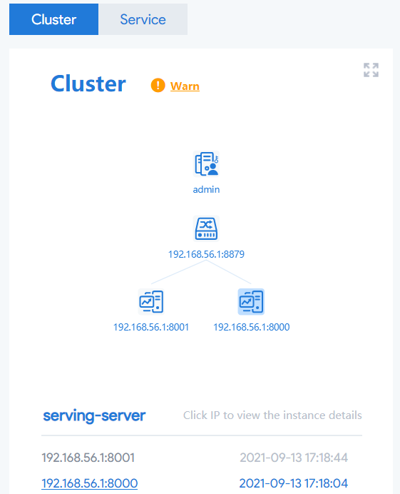
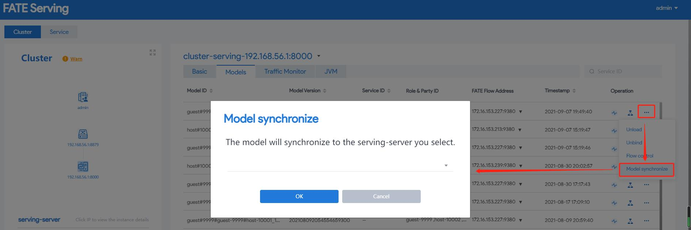
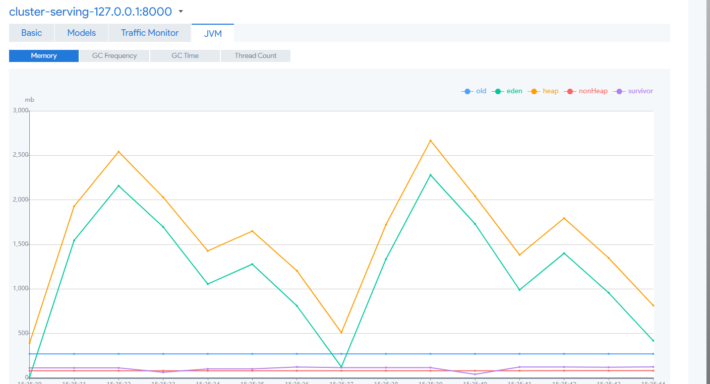

### 简介
serving-admin提供了FATE-Serving集群的可视化操作界面，依赖zookeeper注册中心，可以展示集群中各实例的配置、状态、模型、监控等信息，并可以执行模型的卸载、服务接口的权重调整、流量控制等操作。默认端口8350.可以根据自己需要修改端口。  
在安装serving-admin并启动之后，可以通过浏览器进行访问，默认用户名 admin，密码admin

### 功能介绍
#### 节点管理
节点展示：提供集群组件展示，可切换实例进行操作  

参数配置：展示实例的参数配置及元数据，参数解释请参考[配置详解](..\config\admin.md)

#### 模型管理
模型查询：展示实例从fateflow载入成功的模型，仅显示单方模型，数据使用方会显示绑定的服务ID

列表字段
<table>
  <tr>
    <td>字段名</td>
    <td>备注</td>
  </tr>
  <tr>
    <td>Model ID</td>
    <td>模型ID</td>
  </tr>
  <tr>
    <td>Model Version</td>
    <td>模型版本</td>
  </tr>
  <tr>
    <td>Service ID</td>
    <td>服务ID</td>
  </tr>
  <tr>
    <td>Role & Party ID</td>
    <td>模型对应的角色和节点ID</td>
  </tr>
  <tr>
    <td>Timestamp</td>
    <td>模型发布时间</td>
  </tr>
</table>

模型调用监控：模型列表右侧可展示模型调用监控，绿色线条为调用量，红色线条为异常次数。一次调用批量预测模型调用量为请求参数中 batchDataList 数量

模型解绑：可以对模型绑定的服务ID进行解绑，并注销对应服务注册的服务接口

模型卸载：卸载实例已载入的模型，模型卸载会同时解绑服务ID，并注销注册的服务接口

模型同步：可将当前机器上的模型同步到本机群中其他的serving-server机器上

支持查看模型pipeline：点击可在弹窗中查看当前模型的pipeline

#### 服务管理
服务接口：展示注册中心中各实例注册的服务接口  
列表字段  
<table>
  <tr>
    <td>字段名</td>
    <td>备注</td>
  </tr>
  <tr>
    <td>Project</td>
    <td>服务项目，serving-server为serving，serving-proxy为proxy</td>
  </tr>
  <tr>
    <td>Environment</td>
    <td>环境，模型Bind操作绑定服务ID后，此字段会显示注册的服务接口的服务ID</td>
  </tr>
  <tr>
    <td>Name</td>
    <td>接口名称，{Project}/{Environment}/{ServiceName}</td>
  </tr>
  <tr>
    <td>Host</td>
    <td>服务接口对应grpc服务所在主机</td>
  </tr>
  <tr>
    <td>Port</td>
    <td>服务接口对应grpc服务监听端口</td>
  </tr>
  <tr>
    <td>Weight</td>
    <td>服务接口路由权重，用于调整服务节点之间的流量分配</td>
  </tr>
</table>

接口加权：服务接口加权可以更轻松地在服务发现时实施负载均衡

接口验证：页面提供了接口的简单调用，提供参数即可对接口进行验证，当前可验证inference和batchInference接口

#### 统计/监控
调用量统计：提供实例各接口调用量图表展示，此处仅显示接口调用量

JVM监控：提供JVM信息图表展示，包含Memory（内存情况）、GC Frequency（GC 频率）、GC Time（GC时间）、Thread Count（线程数量）

#### 流量控制
模型调用流量控制：可通过限制模型调用QPS，可进行流量控制，超过限制的请求会被拦截

#### 自检功能
Cluster一键自检工具：由后台定时对Cluster进行自检，用户也可以主动进行一键自检   
页面上增加自检精灵工具，可查看Cluster的服务自检状态   

#### 支持配置生成路由表

#### 服务拓扑图展示

