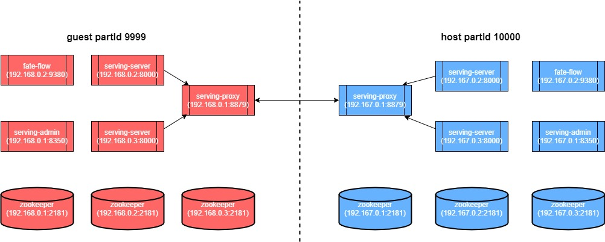

### 部署示例图
下图橙色代表guest ，蓝色代表host。  


### guest部署
•	guest 的serving-proxy application.properties 配置：  
```yml
xxxxxxxxxx
coordinator=9999 
server.port=8059
zk.url=172.168.0.1:2181,172.168.0.2:2181,172.168.0.3:2181
proxy.grpc.intra.port=8879
proxy.grpc.inter.port=9370
```
•	guest 的serving-proxy router_table.json配置：  
```yml
xxxxxxxxxx
{
  "route_table": {
    "default": {
      "default": [
        {
          "ip": "172.134.0.1",
          "port": 9370
        }
      ]
    },
    "9999": {
      "serving": [
        {
          "ip": "172.168.0.2",
          "port": 8000
        }, {
          "ip": "172.168.0.3",
          "port": 8000
        }
      ]
    }
  },
  "permission": {
    "default_allow": true
  }
}
```
由于guest的请求只会向外发送，所以只需要配置出口ip端口就好， 如以上代码所示只需要配置default转发规则，则会将所有请求转发至出口ip。而出口ip需要与host端proxy.grpc.inter.port对齐

•	guest 的 serving-server application.properties 配置： 
```yml
xxxxxxxxxx
port=8000
model.transfer.url=http://172.168.0.2:9380/v1/model/transfer  //FATE flow地址
zk.url=172.168.0.1:2181,172.168.0.2:2181,172.168.0.3:2181
``` 
•	guest 的 serving-admin配置
```yml
xxxxxxxxxx
server.port=8350
zk.url=172.168.0.1:2181,172.168.0.2:2181,172.168.0.2:2181
admin.username=admin
admin.password=admin

```

### host部署
•	host 的serving-proxy application.properties 配置：
```yml
xxxxxxxxxx
coordinator=10000 
server.port=8059
zk.url=172.134.0.1:2181,172.134.0.2:2181,172.134.0.3:2181
proxy.grpc.intra.port=8879
proxy.grpc.inter.port=9370
```
•	host 的serving-proxy router_table.json配置：
```yml
xxxxxxxxxx
{
    "route_table": {
        "default": {
            "default": [{
                "ip": "172.134.0.2",
                "port": 8000
            }]
        },
        "10000": { //上面 application properties里的coordinator
            "serving": [{
                    "ip": "172.134.0.2",
                    "port": 8000
                },
                {
                    "ip": "172.134.0.3",
                    "port": 8000
                }
            ]
        }
    },
    "permission": {
        "default_allow": true
    }
}

```

•	host 的 serving-server配置：
```yml
xxxxxxxxxx
port=8000
model.transfer.url=http://172.134.0.1:9380/v1/model/transfer
zk.url=172.134.0.1:2181,172.134.0.2:2181,172.134.0.3:2181
feature.single.adaptor=com.webank.ai.fate.serving.adaptor.dataaccess.MockAdapter
feature.batch.adaptor=com.webank.ai.fate.serving.adaptor.dataaccess.MockBatchAdapter
```

•	host 的 serving-admin配置
```yml
xxxxxxxxxx
server.port=8350
zk.url=172.134.0.1:2181,172.134.0.2:2181,172.134.0.3:2181
admin.username=admin
admin.password=admin

```