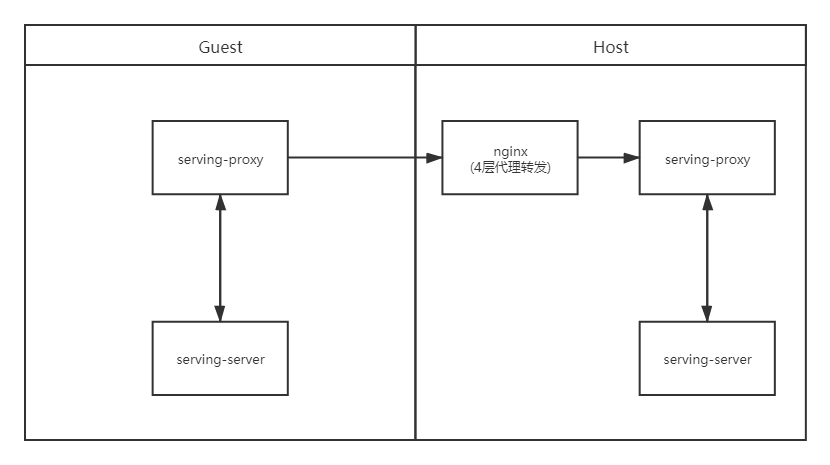

FATE-Serving 之间的交互可以通过nginx反向代理转发grpc请求，以下几种场景配置如下：

* 场景一：双方不配置TLS，通过nginx四层代理转发


* 场景二：双方配置TLS，通过nginx四层代理转发，双方分别进行证书校验


* 场景三：数据使用方配置Client端证书，Nginx配置Server端证书，Host不配置证书，通过nginx七层代理转发，由Client端和nginx进行证书校验


四层代理转发配置
```editorconfig
stream {
  log_format proxy '$remote_addr [$time_local] '
      '$protocol $status $bytes_sent $bytes_received '
      '$session_time "$upstream_addr" '
      '"$upstream_bytes_sent" "$upstream_bytes_received" "$upstream_connect_time"';
    
    upstream next_rollsite {
        hash $remote_addr consistent;
        server 127.0.0.1:8869;      # 转发到下游服务的地址
    }
    
    server {
    listen 8443;          # nginx 监听端口
    proxy_connect_timeout 8s;
    proxy_timeout 24h;
    proxy_pass next_rollsite;
    }
}
```

七层代理转发配置
```editorconfig
http {
    server {
        listen 8443 ssl http2;          # gRPC基于HTTP/2
        server_name localhost;
        
    ssl_protocols TLSv1 TLSv1.1 TLSv1.2;  # 证书协议类型
        ssl_ciphers ECDHE-RSA-AES128-GCM-SHA256:ECDHE:ECDH:AES:HIGH:!DH:!DHE:!RC4:!MD5:!NULL:!aNULL;
    ssl_certificate      ssl/server.crt;  # 证书文件
        ssl_certificate_key  ssl/server.key;  # 私钥
    ssl_session_cache    shared:SSL:10m;
    ssl_session_timeout  5m;
        ssl_verify_client on;
    ssl_prefer_server_ciphers  on;
    ssl_client_certificate ssl/ca.crt;    # 根证书
        
        location / {
            grpc_pass grpc://127.0.0.1:8869;  # 转发到下游服务的地址
            error_page 502 = /error502grpc;   # 错误页面
        }
        
        location = /error502grpc {
            internal;
            default_type application/grpc;
            add_header grpc-status 14;
            add_header grpc-message "unavailable";
            return 204;
        }
    }
}
```