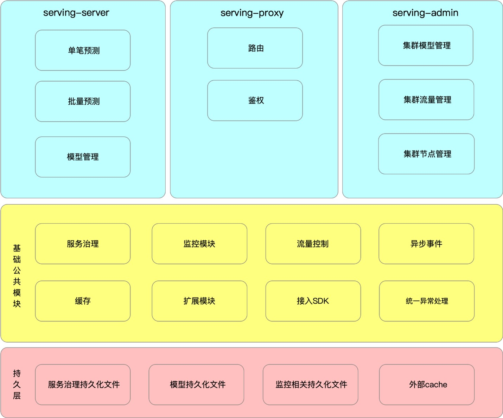
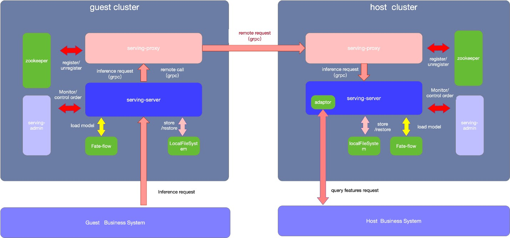
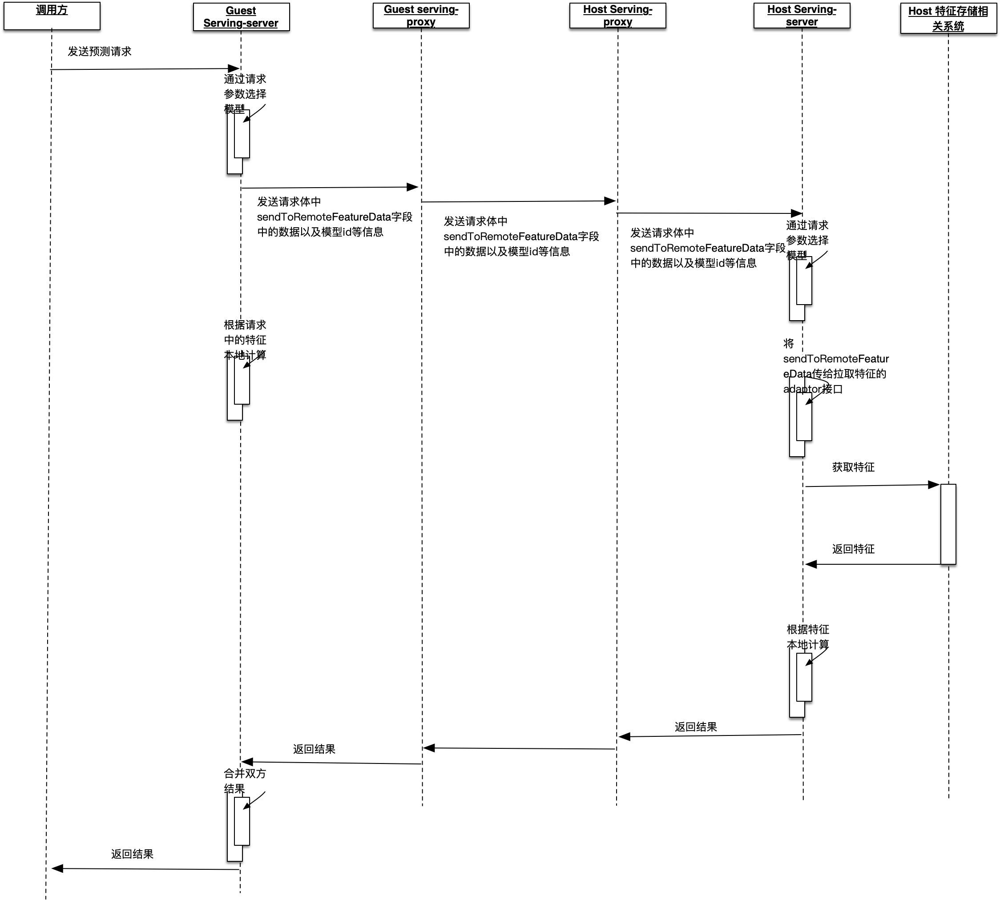

**目前的文档只适用于2.0以上版本**

### 什么是Fate-Serving
fate-serving是FATE的在线部分，在使用FATE进行联邦建模完成之后，可以使用fate-serving进行包括单笔预测、多笔预测以及多host预测在内的在线联合预测。

### Fate-Serving 服务特性
* 订阅与注册的可靠性保证  

目前订阅/取消订阅  、  注册/取消注册操作都使用了定时重试的机制来保证操作的最终成功。

* 客户端服订阅务信息的缓存与持久化  

默认在serving-server实例部署目录下（2.1版本之前是在当前用户目录下）生成.fate 的文件夹，所有的持久化信息都会放入该文件夹。 使用服务治理管理的模块启动之后，首先会从本地缓存文件加载之前订阅的接口，然后再从注册中心拉取并更新本地文件。在极端情况下，如注册中心宕机，本地的持久化文件将继续服务，不会影响业务流量。

* 客户端的负载均衡  
>目前支持加权随机（可以通过serving-admin页面调整接口权重）。

* 服务端的优雅停机     

服务端会在jvm 退出时，主动取消注册在注册中心的接口，拒绝新的请求，并等待当前正在处理的请求退出。 需要注意的是，不能使用kill -9 命令退出，这样不会触发jvm退出前的动作，若进程强制退出，虽然zookeeper会判断心跳超时并将所创建的临时节点消失，但是在心跳还未超时的这段时间里业务流量还会被路由到当前已被kill的实例上来，造成风险。建议使用kill。
### 功能架构图  
  

### 部署架构
fate-serving 的部署架构图如下

如上图所示，整个集群需要有几个组件：  
•	serving-server 
 
>serving-server用于实时处理在线预测请求, 理论上serving-server需要从fate-flow加载模型成功之后才能对外提供服务。 在FATE中建好模型之后，通过fate-flow的推送模型脚本可以将模型推送至serving-server。 推送成功之后，serving-server会将该模型相关的预测接口注册进zookeeper， 外部系统可以通过服务发现获取接口地址并调用。 同时本地文件持久化该模型,以便在serving-server实例在集群中某些组件不可用的情况下，仍然能够从本地文件中恢复模型。支持多host的算法模型：纵向LR、纵向SBT。

•	serving-proxy 
 
>serving-proxy 是serving-server的代理，对外提供了grpc接口以及http的接口， 主要用于联邦预测请求的路由转发鉴权。在离线的联邦建模时， 每一个参与方都会分配一个唯一的partId。serving-proxy维护了一个各参与方partId的路由表， 并通过路由表中的信息来转发请求。

•	serving-admin  

>serving-admin 提供在线集群的可视化操作界面， 可以查看管理集群中各节点的配置以及状态、查看模型列表、流量的调控、并能提供一定的监控的功能。[点击查看详情](./service/admin.md)    

•	zookeeper  
>zookeeper 用于各组件的信息同步协调以及服务注册与发现

### 工作时序图

 
