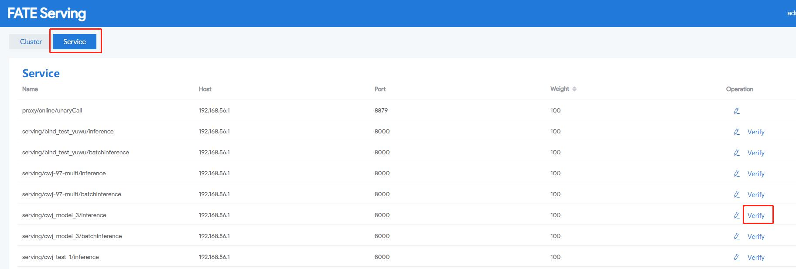

推理接口支持[单笔](./single.md)以及[批量](./batch.md)接口。目前有以下几方式调用推理接口，具体采用哪种方式可以根据实际情况选择。 

1. 使用guest方serving-admin页面发送请求。    
优点：使用简单，可用作测试。

2.访问serving-proxy的http接口 ，由serving-proxy转发请求至serving-server。    
优点：接入简单，可在serving-proxy前面增加nginx作为反向代理。

3.使用源码中自带的SDK访问serving-server。  
优点：省去了中间serving-proxy作为转发节点 ，提高通信效率。并将使用fate-serving的服务注册以及发现等功能，直接调用serving-server的grpc接口

4.自行开发并直接调用serving-server提供的grpc接口。     
优点：目前sdk部分只提供了java版，若是其他未支持的语言，可以自行开发并调用相关接口 。部署时可以采用 nginx前置部署，用于反向代理grpc请求。

### 错误码表
<table>
  <tr>
    <td>错误码低三位</td>
    <td>描述</td>
  </tr>
  <tr>
    <td>0</td>
    <td>成功</td>
  </tr>
  <tr>
    <td>100</td>
    <td>参数解析错误</td>
  </tr>
  <tr>
    <td>102</td>
    <td>Adaptor 特征错误</td>
  </tr>
  <tr>
    <td>104</td>
    <td>模型不存在</td>
  </tr>
  <tr>
    <td>105</td>
    <td>网络错误</td>
  </tr>
  <tr>
    <td>106</td>
    <td>路由错误</td>
  </tr>
  <tr>
    <td>107</td>
    <td>加载模型失败</td>
  </tr>
  <tr>
    <td>108</td>
    <td>合并预测结果失败</td>
  </tr>
  <tr>
    <td>109</td>
    <td>绑定模型失败</td>
  </tr>
  <tr>
    <td>110</td>
    <td>系统错误</td>
  </tr>
  <tr>
    <td>111</td>
    <td>服务已关闭</td>
  </tr>
  <tr>
    <td>113</td>
    <td>特征不存在</td>
  </tr>
  <tr>
    <td>116</td>
    <td>Adaptor 返回失败</td>
  </tr>
  <tr>
    <td>120</td>
    <td>请求参数错误</td>
  </tr>
  <tr>
    <td>121</td>
    <td>鉴权失败</td>
  </tr>
  <tr>
    <td>122</td>
    <td>未找到服务</td>
  </tr>
  <tr>
    <td>123</td>
    <td>模型初始化失败</td>
  </tr>
  <tr>
    <td>124</td>
    <td>请求负载错误</td>
  </tr>
  <tr>
    <td>125</td>
    <td>不支持的指令</td>
  </tr>
  <tr>
    <td>126</td>
    <td>取消注册错误</td>
  </tr>
  <tr>
    <td>127</td>
    <td>无效的口令</td>
  </tr>
  <tr>
    <td>128</td>
    <td>serving-proxy路由错误</td>
  </tr>
  <tr>
    <td>129</td>
    <td>serving-proxy鉴权失败</td>
  </tr>
</table>