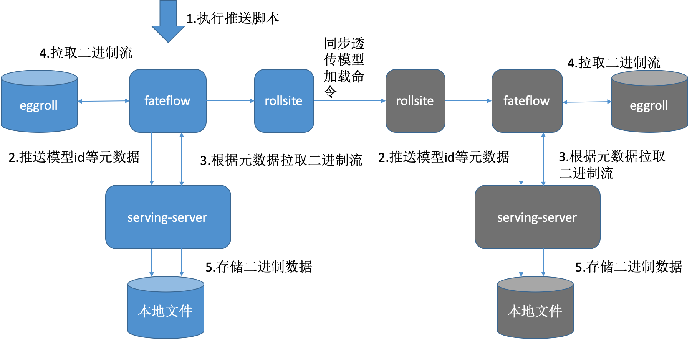

源码中提供了简单的LR模型用于进行简单测试，可以在没有安装FATE的情况下使用该模式。将 [example/model_cache_example.zip](../src/model_cache_example.zip) 解压至guest与host双方serving-server实例部署目录下的.fate目录下（若是不存在可手动新建该目录），重启即可自动加载模型并绑定到lr-test。

### 模型推送流程
前面介绍了如何安装各个组件，在各组件都成功安装后，接下来需要将模型推送至serving-server。 
    
推送模型的一般流程是：  
1. 通过FATE建模  
2. 分别部署guest方 Fate-serving 与host方Fate-serving
3. 分别配置好guest方Fate-flow与guest方Fate-serving、host方Fate-flow 与host方Fate-serving。Fateflow配置见github上的介绍，下文简单罗列了Fateflow的配置，可用作参考。
4. Fate-flow推送模型
5. Fate-flow将模型绑定serviceId
6. 以上操作完成后，可以在serving-admin页面上查看模型相关信息（此步操作非必需）。
7. 可以在serving-admin页面上测试调用（此步操作非必需）。

具体的工作流程如下图所示 蓝色为guest集群，灰色代表host集群  



### FATE-Flow的配置（以1.4.x 版本为例）
在执行模型的推送和绑定操作之前，需要先配置FATE-Flow,并重启FATE-Flow。 
>**Note:** 多方都需要修改成各自FATE-Serving的实际部署地址

#### 未启用注册中心(zookeeper)
修改arch/conf/server_conf.json，填入FATE-Serving集群实际部署serving-server服务的ip:port，如：
```yml
xxxxxxxxxx
"servings": [
    "192.168.1.1:8000",
    "192.168.1.2:8000"
]
```

#### 启用注册中心
•	修改部署目录下arch/conf/base_conf.yaml
```yml
xxxxxxxxxx
use_registry: true
zookeeper:
    hosts:
     - 192.168.1.1:2181
     - 192.168.1.1:2182
```
其中zookeeper.hosts填入FATE-Serving集群实际部署Zookeeper的ip:port

•	若zookeeper开启了ACL，则需要添加以下配置，否则略过此步骤。修改部署目录下arch/conf/base_conf.yaml
```yml
xxxxxxxxxx
zookeeper:
    use_acl: true
    user: fate
    password: fate
```
其中use与password填入FATE-Serving集群实际部署ZooKeeper的用户名与密码

>**Note**: 配置完上述文件后重启Fate-Flow服务以生效

#### 模型发布
配置路径：$pythonpath/fate_flow/examples/publish_load_model.json  
修改内容：将实际任务配置（initiator, role, job_parameters）进行修改，请确保model_id及model_version与离线训练的模型的相同。  
配置格式：
```json
{
    "initiator": {
        "party_id": "10000",
        "role": "guest"
    },
    "role": {
        "guest": ["10000"],
        "host": ["10000"],
        "arbiter": ["10000"]
    },
    "job_parameters": {
        "work_mode": 1,
        "model_id": "arbiter-10000#guest-9999#host-10000#model",
        "model_version": "202006122116502527621"
    }
}
​
```

#### 模型绑定
配置路径：$pythonpath/fate_flow/examples/bind_model_service.json  
修改内容：自定义service_id，后续将利用该service_id将模型绑定到模型服务中。将实际任务配置（initiator, role, job_parameters）进行修改，请确保model_id及model_version与离线训练的模型相同。  
配置格式：
```json
{
    "service_id": "",
    "initiator": {
        "party_id": "10000",
        "role": "guest"
    },
    "role": {
        "guest": ["10000"],
        "host": ["10000"],
        "arbiter": ["10000"]
    },
    "job_parameters": {
        "work_mode": 1,
        "model_id": "arbiter-10000#guest-10000#host-10000#model",
        "model_version": "202006122116502527621"
    },
    "servings": [
    ]
}
```
### 模型在内存中的结构


### 常见问题
<table>
  <tr>
    <td>常见问题</td>
    <td>可能原因</td>
    <td>解决方案</td>
  </tr>
  <tr>
    <td>加载（load）/绑定（bind）模型提示“Please configure servings address”</td>
    <td>用户未在server_conf中配置FATE-Serving的ip地址及端口</td>
    <td>正确修改server_conf中的serving组件配置，重启fate_flow_server后进行重试。</td>
  </tr>
  <tr>
    <td>加载（load）模型提示“failed”</td>
    <td>FATE rollsite或serving组件未启动</td>
    <td>检查$pythonpath/logs/fate_flow/fate_flow_stat.log，确定是否有组件未启动，如果有，请正确启动组件后重试。</td>
  </tr>
  <tr>
    <td>加载（load）模型提示“Only deployed models could be used to execute process of loading. Please deploy model before loading”</td>
    <td>在fate1.5.x以后版本提供了两种dsl（v1/v2）训练模型，用dsl_v1时不需要执行deploy操作，用dsl_v2是需要的</td>
    <td>在load之前先执行deploy操作生成新模型，然后再用deploy生成的模型id/version进行在线的load操作</td>
  </tr>  
  <tr>
    <td>绑定（bind）模型提示“no service id”</td>
    <td>bind任务配置文件中未指定service_id</td>
    <td>修改bind任务配置文件，自定义指定service_id。</td>
  </tr>
</table>

>更多FATE-Flow问题请查看[FATE-Flow](https://github.com/FederatedAI/FATE/tree/master/python/fate_flow)