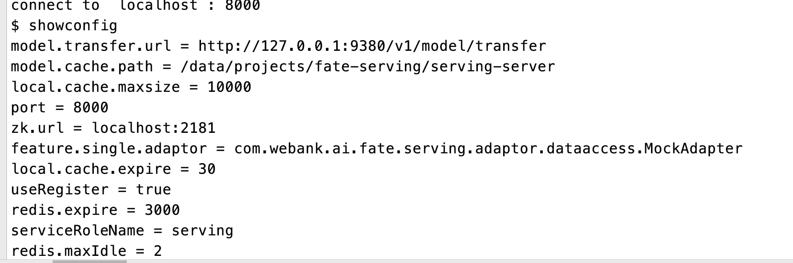
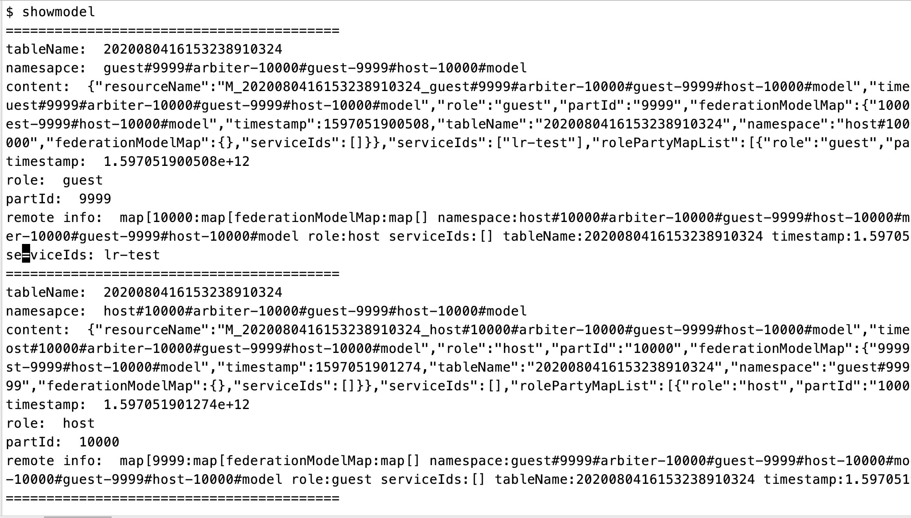

FATE-Serving提供了fate-serving-client工具进行 下载系统对应版本fate-serving-client：
>linux版本：[fate-serving-client-2.1.0-linux.tar.gz](https://webank-ai-1251170195.cos.ap-guangzhou.myqcloud.com/fate-serving-client-2.1.0-linux.tar.gz )     
>mac版本：[fate-serving-client-2.1.0-darwin.tar.gz](https://webank-ai-1251170195.cos.ap-guangzhou.myqcloud.com/fate-serving-client-2.1.0-darwin.tar.gz)

在终端中使用`./fate-serving-client`启动， 默认情况下，client连接localhost:8000，使用参数可以指定目标地址`./fate-serving-client [-h host] [-p port] `host为需要连接的serving-server的ip ， port 为serving-server对外暴露的端口。
>./fate-serving-client -h 127.0.0.1 -p 8000


提供了以下几种指令：

* showconfig 查看服务配置



* showmodel 查看已发布的模型信息



* inference 在线单笔预测，参数为参数文件路径，如：
>inference  /data/projects/request.json     

 /data/projects/request.json文件的内容为：
 ```json
{
    "serviceId": "lr-test",
    "featureData": {
        "x0": 0.100016,
        "x1": 1.21,
        "x2": 2.321,
        "x3": 3.432,
        "x4": 4.543,
        "x5": 5.654,
        "x6": 5.654,
        "x7": 0.102345
    },
    "sendToRemoteFeatureData": {
        "id": "8"
    }
}
``` 


* batchInference 在线批量预测，参数为参数文件路径，如：
>batchInference /data/projects/request.json 

/data/projects/request.json 的内容为： 
```json
{
    "serviceId": "lr-test",
    "batchDataList": [
        {
            "index": 0,
            "featureData": {
                "x0": 0.4853,
                "x1": 1.1996,
                "x2": -1.574,
                "x3": -0.8811,
                "x4": -0.6176,
                "x5": 0.5997,
                "x6": -0.5361,
                "x7": -0.1189,
                "x8": -1.5728
            },
            "sendToRemoteFeatureData": {
                "device_id": "299",
                "phone_num": 585
            }
        }
    ]
}
```

* help 查看帮助信息
> help

* quit 关闭连接
> quit