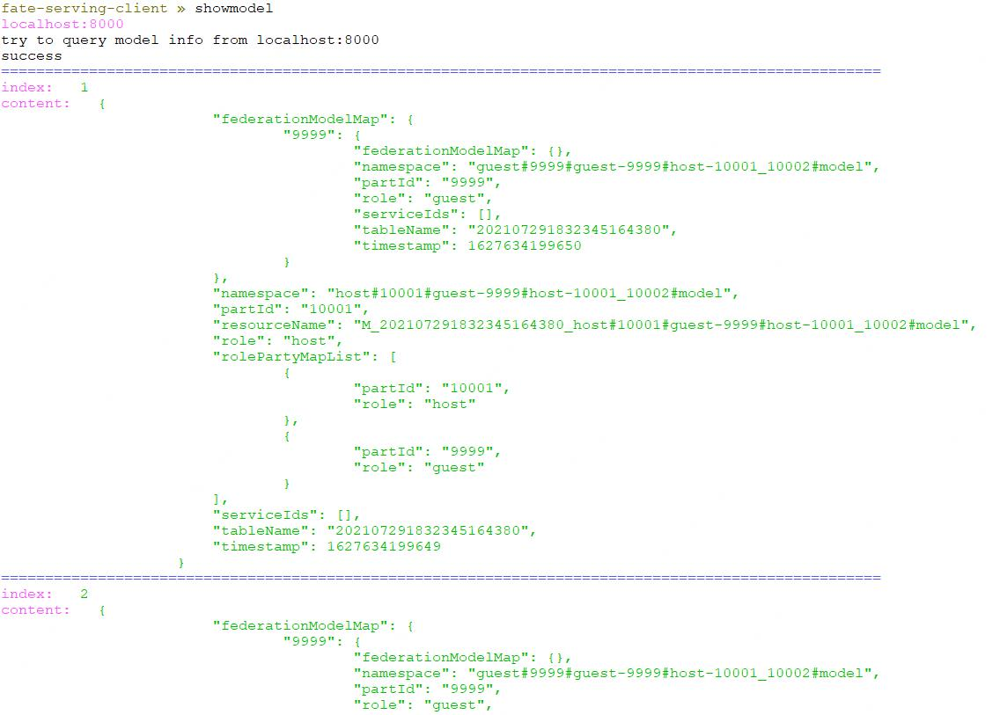

FATE-Serving提供了fate-serving-client工具进行 下载系统对应版本fate-serving-client：
>linux版本：[fate-serving-client-2.1.0-linux.tar.gz](https://webank-ai-1251170195.cos.ap-guangzhou.myqcloud.com/fate-serving-client-2.1.0-linux.tar.gz )     
>mac版本：[fate-serving-client-2.1.0-darwin.tar.gz](https://webank-ai-1251170195.cos.ap-guangzhou.myqcloud.com/fate-serving-client-2.1.0-darwin.tar.gz)

需要先确认下载解压出来的文件有没有可执行权限，没有权限就执行 `chmod +777 fate-serving-client-2.1.0-linux`授权。

* 在终端中使用`./fate-serving-client`启动client


提供了以下几种指令：
* help 查看帮助信息


* showconfig 查看服务配置


* showmodel 查看已发布的模型信息



* flow 查看调用情况信息


* showHealthInfo 查看健康监测信息


* jvm 查看JVM信息


* zk 查看zookeeper注册服务信息


* clear 清空当前控制台内容


* inference 在线单笔预测


-f 参数为请求参数文件的路径；/data/projects/request.json文件内容，示例：
 ```json
{
    "serviceId": "lr-test",
    "featureData": {
        "x0": 0.100016,
        "x1": 1.21,
        "x2": 2.321,
        "x3": 3.432,
        "x4": 4.543,
        "x5": 5.654,
        "x6": 5.654,
        "x7": 0.102345
    },
    "sendToRemoteFeatureData": {
        "id": "8"
    }
}
``` 


* batchInference 在线批量预测


-f 参数为请求参数文件的路径；/data/projects/request.json文件内容，示例：
```json
{
    "serviceId": "lr-test",
    "batchDataList": [
        {
            "index": 0,
            "featureData": {
                "x0": 0.4853,
                "x1": 1.1996,
                "x2": -1.574,
                "x3": -0.8811,
                "x4": -0.6176,
                "x5": 0.5997,
                "x6": -0.5361,
                "x7": -0.1189,
                "x8": -1.5728
            },
            "sendToRemoteFeatureData": {
                "device_id": "299",
                "phone_num": 585
            }
        }
    ]
}
```

* exit 关闭连接


